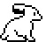
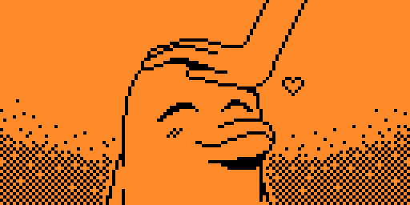
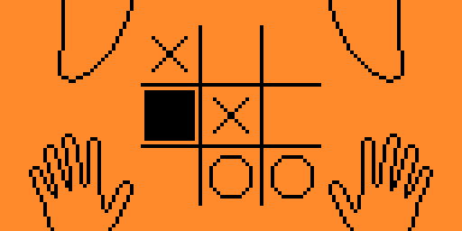
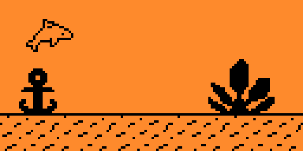
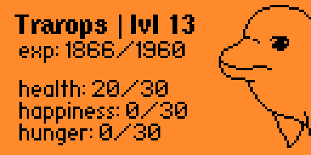
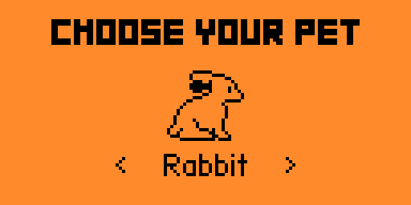
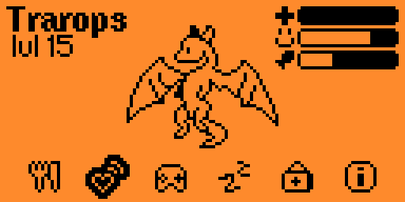
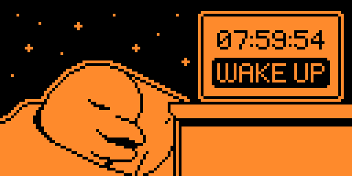

# Zerogotchi

Virtual pet for Flipper Zero with zero purpose and questionable survival instincts.


## Features

### Adopt a pet

| Dolphin | Dragon | Rabbit |
| ------- | ------ | ------ |
|  |  |  |

Choose your pet! Your **pet's name** is the name stored in your Flipper's system.

### Life stages

The pet has three growth stages: **child**, **teen**, and **adult**.


It grows as it gains experience and levels up.

###  Feeding

You can feed your pet one of **3 different dishes** or a **treat**. Each option affects its stats in a slightly different way.
* **Dish 1**: +2 happiness, +3 hunger
* **Dish 2**: +5 hunger
* **Dish 3**: +4 happiness, +2 hunger
* **Treat**: -3 health, +5 happiness, +4 hunger

*Keep in mind that feeding your pet too many treats isn't the best choice!*

###  Petting

You can pet your pet to make it happy!



###  Playing

There are three mini-games here to pass the time with your pet.
* **Tic Tac Toe**: Classic tic-tac-toe game
* **No Signal**: T-Rex runner-like game with your pet
* **Memory**: game

|                 Tic Tac Toe                 |                No Signal                 |                  Memory                  |
| ------------------------------------------- | ---------------------------------------- | ---------------------------------------- |
|  |  |  |

###  Sleeping

The pet should rest so that it doesn't get tired too quickly!

The sleep lasts 8 hours, but it can be interrupted at any moment. *However, this will have a negative effect on the pet.*

###  Healing

You can heal your pet with one of **3 different medicines**. Each option affects its stats in a slightly different way.
* **Vitamins**: +2 health, -1 happiness
* **Pills**: +4 health, -2 happiness
* **Injection**: +5 health, -4 happiness

###  Status check

On the information tab, you can view detailed information about your pet. 



You can also see your pet's current mood here:
* **Happy**: stats are normal
* **Sad**: hunger or happiness are under 10 points
* **Ill**: health is under 10 points
* **Sleep**: pet is sleeping

|               Happy                |              Sad               |              Ill               |               Sleep                |
| ---------------------------------- | ------------------------------ | ------------------------------ | ---------------------------------- |
|  |  |  |  |

If your pet has low stats, it will be harder to get them back to normal, but your pet will still *always be with you*.

## Installation

### Option 1: Download a Release
1. Download the latest `.fap` file from the [releases page](https://github.com/udruufa/Zerogotchi/releases).
2. Open qFlipper and connect your Flipper Zero.
3. Copy the `.fap` file to the `Apps`/`Games` folder on your Flipper Zero.
4. Open it from your Flipper Zero menu.

### Option 2: Build from Source (using fbt)
```bash
# Navigate to the firmware source directory
cd flipperzero-firmware

# Clone the repository
git clone https://github.com/udruufa/Zerogotchi.git /applications_user/zerogotchi

# Build and install the app
./fbt fap_zerogotchi
```

## Screenshots

|               Adopt screen               |               Main screen               |                Sleep screen              |
| ---------------------------------------- | --------------------------------------- | ---------------------------------------- |
|  |  |  |
